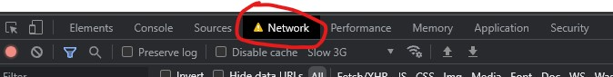
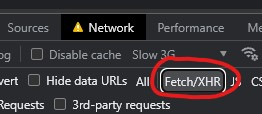
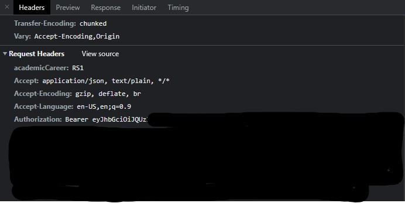

# How to get your bearer token

> To get your bearer token, make sure you have logged in to [newbinusmaya.binus.ac.id](newbinusmaya.binus.ac.id).

> **🛑 Warning do not share your bearer token with anyone else 🛑**

- Open the developer tools (F12) and go to Network tab.



- Toggle on the fetch/xhr option.



- Go to the courses page (Keep the devtools open).

- After you have done that, you can see some request logs in the network tab with the name **Student**, pick any one of them, go to Headers tab, and at the Request Headers section you will see the bearer token by the **Authorization** header.



- Copy only the token (Not the 'Bearer' or 'Authorization' part) and paste it to the `BINUS_BEARER_TOKEN` variable. Like so:

```text
BINUS_BEARER_TOKEN=eyJhbGciOiJQUz....
```

That's it!

> **🛑 Warning do not share your bearer token with anyone else 🛑**